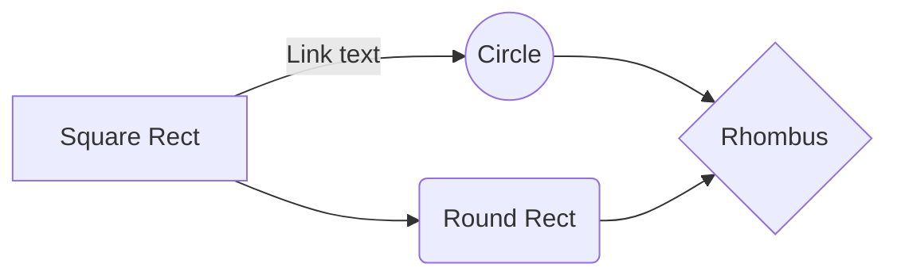

# Table

<table width="100%" cellpadding="0" cellspacing="0">
	<tr valign="top">
		<td width="33%" style="border: 1px solid #000000; padding: 0cm">
<b>Колонка
			1 Строка 1</b>

		</td>
		<td colspan="2" width="67" style="border: 1px solid #000000; padding: 0cm">

			<b>Колонка 2-3</b>

		</td>
	</tr>
	<tr valign="top">
		<td rowspan="4" width="33%" style="border: 1px solid #000000; padding: 0cm">

			Колонка 1 Строка 2-4

		</td>
		<td width="33%" style="border: 1px solid #000000; padding: 0cm">
Колонка
			2 Строка 2

		</td>
		<td width="33%" style="border: 1px solid #000000; padding: 0cm">
Колонка
			3 Строка 2

		</td>
	</tr>
	<tr valign="top">
		<td width="33%" style="border: 1px solid #000000; padding: 0cm">
Колонка
			2 Строка 3

		</td>
		<td width="33%" style="border: 1px solid #000000; padding: 0cm">
Колонка
			3 Строка 3

		</td>
	</tr>
	<tr valign="top">
		<td width="33%" style="border: 1px solid #000000; padding: 0cm">
Колонка
			2 Строка 4

		</td>
		<td width="33%" style="border: 1px solid #000000; padding: 0cm">
Колонка
			3 Строка 4

		</td>
	</tr>
	<tr valign="top">
		<td width="33%" style="border: 1px solid #000000; padding: 0cm">
Колонка
			2 Строка 5

		</td>
		<td width="33%" style="border: 1px solid #000000; padding: 0cm">
Колонка
			3 Строка 4

		</td>
	</tr>
</table>

# GRAPH

# TABLES

# 

| Left-Aligned  | Center Aligned  | Right Aligned |
|:------------- |:---------------:| -------------:|
| col 3 is      | some wordy text |     **$1600** |
| col 2 is      | centered        |         $12   |
| zebra stripes | are neat        |        ~~$1~~ |

<table _ngcontent-jsn-c151="" class="table" style="table-layout: fixed;" width="100%" contenteditable="false">
    <thead>
        <th colspan="3" align="left">Text for columns: 1 and 2 (Merged)</th>
    </thead>
    <tr>
        <td><b>Column 1. Row 2 Text</b></td>
        <td colspan="2"><b>Column 2. Row 2 Text</b></td>
    </tr>
    <tr>
        <td>Column 1. Row 3 Text</td>
        <td>Column 2. Row 3 Text</td>
        <td>Column 3. Row 3 Text</td>
    </tr>
</table>

Information!
For your convenience, there is a placeholder in each field to get the idea of how it should be filled in.

Settings Table

<table _ngcontent-jsn-c151="" class="table" style="table-layout: fixed;" contenteditable="false">
   <thead>
      <tr>
         <th>Column 1</th>
         <th>Column 2</th>
         <th>Column 3</th>
      </tr>
   </thead>
   <tbody>
      <tr>
         <td colspan="2" style="text-align: center; vertical-align: middle;">Text for columns: 1 and 2 (Merged)</td>
         <td>Text for column 3</td>
      </tr>
      <tr>
         <td>Text for column 1</td>
         <td>Text for column 2</td>
         <td>Text for column 3</td>
      </tr>
      <tr>
        <td rowspan="3" style="vertical-align: middle;">Text for rows 1 to 3 (Merged)</td>
        <td>Text for column 2</td>
        <td>Text for column 3</td>
      </tr>
      <tr>
        <td>Text for column 2</td>
        <td>Text for column 3</td>
      </tr>
      <tr>
        <td>Text for column 2</td>
        <td>Text for column 3</td>
      </tr>
      <tr>
        <td>Text for column 1</td>
        <td td colspan="2" style="text-align: center; vertical-align: middle;">Text for columns: 2 and 3</td>
     </tr>
     <tr>
        <td>Text for column 1</td>
        <td>Text for column 2</td>
        <td>Text for column 3</td>
     </tr>
     <tr>
        <td>Text for column 1</td>
        <td rowspan="3" style="vertical-align: middle;">Text for column 2 (Merged 3 rows of the second column).</td>
        <td>Text for column 3</td>
     </tr>
     <tr>
        <td>Text for column 1</td>
        <td>Text for column 3</td>
      </tr>
      <tr>
        <td>Text for column 1</td>
        <td>Text for column 3</td>
      </tr>
   </tbody>
</table>
