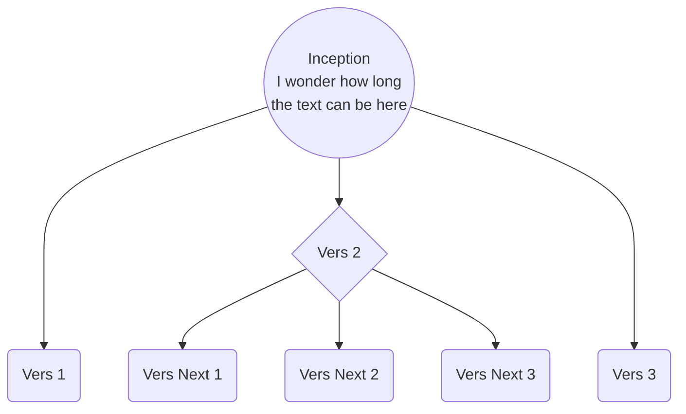
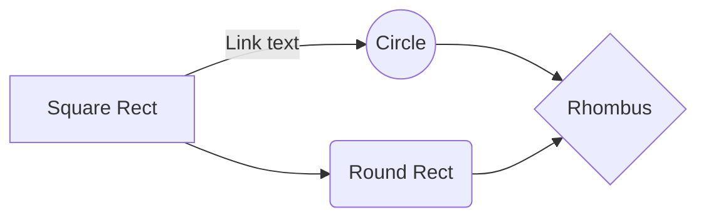

<table class="table" style="table-layout: fixed;" cellpadding="0" cellspacing="0">
	<tr valign="top">
		<td width="30%" style="border: 1px solid #000000; padding: 0cm">
<b>Field</b>

		</td>
		<td width="70%" style="border: 1px solid #000000; padding: 0cm">

			<b>Description</b>

		</td>
	</tr>
	<tr valign="top">
		<td width="30%" style="border: 1px solid #000000; padding: 0cm">

			<b>Type</b>

		</td>
		<td width="70%" style="border: 1px solid #000000; padding: 0cm">
<b>Bank card</b> as a payment method is selected from the drop-down list.

		</td>
	</tr>
	<tr valign="top">
		<td width="30%" style="border: 1px solid #000000; padding: 0cm">

			<b>Subtype</b>

		</td>
		<td width="70%" style="border: 1px solid #000000; padding: 0cm">
Payment method configured in the <b>Integrations → Payment methods</b> section of the Dashboard and selected from the drop-down list.

		</td>
	</tr>
	<tr valign="top">
		<td colspan="2" width="100%" style="border: 1px solid #000000; padding: 0cm">

			The fields below are available for both <b>Data</b> and <b>Fixed data</b> sections of the table.

		</td>
	</tr>
	<tr valign="top">
		<td width="30%" style="border: 1px solid #000000; padding: 0cm">

			<b>First name</b>

		</td>
		<td width="70%" style="border: 1px solid #000000; padding: 0cm">
First name of the card holder as written on the bank card. The field may contain a <b>Cardholder</b> title (or something like that) if the card is non-personalized.

		</td>
	</tr>
	<tr valign="top">
		<td width="30%" style="border: 1px solid #000000; padding: 0cm">

			<b>Last name</b>

		</td>
		<td width="70%" style="border: 1px solid #000000; padding: 0cm">
Last name of the card holder as written on the bank card.  The field may be blank if the card is non-personalized.

		</td>
	</tr>
	<tr valign="top">
		<td width="30%" style="border: 1px solid #000000; padding: 0cm">

			<b>Number</b>

		</td>
		<td width="70%" style="border: 1px solid #000000; padding: 0cm">
Card number.  Only the first four and last four digits are shown.

		</td>
	</tr>
	<tr valign="top">
		<td width="30%" style="border: 1px solid #000000; padding: 0cm">

			<b>Valid until</b>

		</td>
		<td width="70%" style="border: 1px solid #000000; padding: 0cm">
Card expiry date in the <b>YYYY-MM</b> format.

		</td>
	</tr>
	<tr valign="top">
		<td width="30%" style="border: 1px solid #000000; padding: 0cm">

			<b>Issue date</b>

		</td>
		<td width="70%" style="border: 1px solid #000000; padding: 0cm">
Card issue date if there is such information on the card.

		</td>
	</tr>
	<tr valign="top">
		<td width="30%" style="border: 1px solid #000000; padding: 0cm">

			<b>Transaction amount</b>

		</td>
		<td width="70%" style="border: 1px solid #000000; padding: 0cm">
The amount of the current transaction.  The field may be blank if the applicant is uploading the card data only for registering and not for a particular transaction.

		</td>
	</tr>
</table>

⚠️ Fixed data is the card info that you can submit to us via API to compare with extracted data.

# Table

<table class="table" style="table-layout: fixed;" cellpadding="0" cellspacing="0">
	<tr valign="top">
		<td width="30%" style="border: 1px solid #000000; padding: 0cm">
<b>Колонка
			1 Строка 1</b>

		</td>
		<td colspan="2" width="70" style="border: 1px solid #000000; padding: 0cm">

			<b>Колонка 2-3</b>

		</td>
	</tr>
	<tr valign="top">
		<td rowspan="4" width="30%" style="border: 1px solid #000000; padding: 0cm">

			Колонка 1 Строка 2-4

		</td>
		<td width="35%" style="border: 1px solid #000000; padding: 0cm">
Колонка
			2 Строка 2

		</td>
		<td width="35%" style="border: 1px solid #000000; padding: 0cm">
Колонка
			3 Строка 2

		</td>
	</tr>
	<tr valign="top">
		<td width="35%" style="border: 1px solid #000000; padding: 0cm">
Колонка
			2 Строка 3

		</td>
		<td width="35%" style="border: 1px solid #000000; padding: 0cm">
Колонка
			3 Строка 3

		</td>
	</tr>
	<tr valign="top">
		<td width="35%" style="border: 1px solid #000000; padding: 0cm">
Колонка
			2 Строка 4

		</td>
		<td width="35%" style="border: 1px solid #000000; padding: 0cm">
Колонка
			3 Строка 4

		</td>
	</tr>
	<tr valign="top">
		<td width="35%" style="border: 1px solid #000000; padding: 0cm">
Колонка
			2 Строка 5

		</td>
		<td width="35%" style="border: 1px solid #000000; padding: 0cm">
Колонка
			3 Строка 5

		</td>
	</tr>
</table>

# GRAPH

# TABLES

# 

| Left-Aligned  | Center Aligned  | Right Aligned |
|:------------- |:---------------:| -------------:|
| col 3 is      | some wordy text |     **$1600** |
| col 2 is      | centered        |         $12   |
| zebra stripes | are neat        |        ~~$1~~ |

<table _ngcontent-jsn-c151="" class="table" style="table-layout: fixed;" width="100%" contenteditable="false">
    <thead>
        <th colspan="3" align="left">Text for columns: 1 and 2 (Merged)</th>
    </thead>
    <tr>
        <td><b>Column 1. Row 2 Text</b></td>
        <td colspan="2"><b>Column 2. Row 2 Text</b></td>
    </tr>
    <tr>
        <td>Column 1. Row 3 Text</td>
        <td>Column 2. Row 3 Text</td>
        <td>Column 3. Row 3 Text</td>
    </tr>
</table>

Information!
For your convenience, there is a placeholder in each field to get the idea of how it should be filled in.

Settings Table

<table _ngcontent-jsn-c151="" class="table" style="table-layout: fixed;" contenteditable="false">
   <thead>
      <tr>
         <th>Column 1</th>
         <th>Column 2</th>
         <th>Column 3</th>
      </tr>
   </thead>
   <tbody>
      <tr>
         <td colspan="2" style="text-align: center; vertical-align: middle;">Text for columns: 1 and 2 (Merged)</td>
         <td>Text for column 3</td>
      </tr>
      <tr>
         <td>Text for column 1</td>
         <td>Text for column 2</td>
         <td>Text for column 3</td>
      </tr>
      <tr>
        <td rowspan="3" style="vertical-align: middle;">Text for rows 1 to 3 (Merged)</td>
        <td>Text for column 2</td>
        <td>Text for column 3</td>
      </tr>
      <tr>
        <td>Text for column 2</td>
        <td>Text for column 3</td>
      </tr>
      <tr>
        <td>Text for column 2</td>
        <td>Text for column 3</td>
      </tr>
      <tr>
        <td>Text for column 1</td>
        <td td colspan="2" style="text-align: center; vertical-align: middle;">Text for columns: 2 and 3</td>
     </tr>
     <tr>
        <td>Text for column 1</td>
        <td>Text for column 2</td>
        <td>Text for column 3</td>
     </tr>
     <tr>
        <td>Text for column 1</td>
        <td rowspan="3" style="vertical-align: middle;">Text for column 2 (Merged 3 rows of the second column).</td>
        <td>Text for column 3</td>
     </tr>
     <tr>
        <td>Text for column 1</td>
        <td>Text for column 3</td>
      </tr>
      <tr>
        <td>Text for column 1</td>
        <td>Text for column 3</td>
      </tr>
   </tbody>
</table>
